# <p align="center">☄️ &nbsp;Pybeaut  ☄️</p>

### <p align="center">_A Python module to stylize terminal outputs with colors, fades, boxes, and animations._</p>

<p align="center">
  
  
  
</p>

---

## Installation

**pip**
```bash
pip install pybeaut
```

**uv** (recommended)
```bash
uv add pybeaut
```

---

## Usage

### With uv

```bash
# Run a script directly — uv resolves the environment automatically
uv run python my_script.py
```

### With a virtual environment

```bash
# Create and activate the environment
uv venv
.venv\Scripts\activate        # Windows
# source .venv/bin/activate   # Linux / macOS

uv pip install pybeaut
python my_script.py
```

---

## 🔰 Features

- ✅ Static & dynamic RGB colors
- ✅ Colorate texts (vertical, horizontal, diagonal fades)
- ✅ Center and align texts
- ✅ Combine banners side by side
- ✅ Text boxes and banners
- ✅ Animated write effect with color fade
- ✅ System utilities (clear, title, size)

---

## ❗ PLEASE NOTE

> [!IMPORTANT]
> This module uses RGB color representations to perform color operations such as fades and gradients.
> Some terminals may not support this functionality, especially in non-Windows 10/11 environments.
> Make sure your terminal supports RGB colors to avoid display issues.

---

## Quick Start

```python
from pybeaut import Colorate, Colors

print(Colorate.Color(Colors.cyan, "Hello from Pybeaut!"))
```

---

## 🎨 Colorate

The core of Pybeaut. Apply **static colors** or **gradient fades** to any text.

### Static color

```python
from pybeaut import Colorate, Colors

print(Colorate.Color(Colors.green,  "This is green"))
```

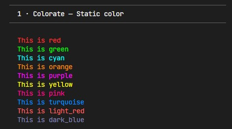

### Vertical fade

Each **line** gets a different color step along the gradient.

```python
from pybeaut import Colorate, Colors

text = (
    "Pybeaut vertical fade\n"
    "Every line shifts color\n"
    "Red bleeds into blue\n"
    "Smoothly, line by line"
)
print(Colorate.Vertical(Colors.red_to_blue, text))
```

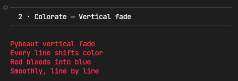

### Horizontal fade

Each **character** on a line gets a different color step.

```python
from pybeaut import Colorate, Colors

print(Colorate.Horizontal(Colors.blue_to_purple, "Horizontal fade — every character shifts color across the line!"))
```

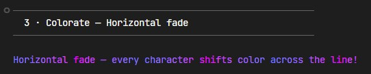

### Diagonal fade

The gradient travels **diagonally** across both lines and characters.

```python
from pybeaut import Colorate, Colors

text = (
    "Diagonal color fade\n"
    "The gradient moves\n"
    "Across lines and chars\n"
    "Like a slanted rainbow"
)
print(Colorate.Diagonal(Colors.green_to_blue, text))
```

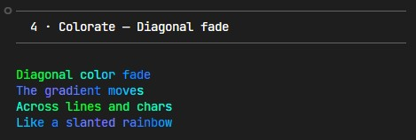

### Diagonal Backwards

Same as diagonal but the gradient goes from **right to left**.

```python
from pybeaut import Colorate, Colors

text = (
    "Backwards diagonal\n"
    "Gradient reversed\n"
    "Right side is brighter"
)
print(Colorate.DiagonalBackwards(Colors.yellow_to_red, text))
```

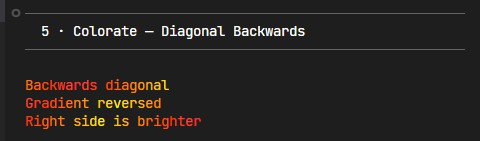

### Format — accent characters

Apply a fade to the main text and a separate color to specific accent characters.

```python
from pybeaut import Colorate, Colors

text = (
    "[ Pybeaut ]\n"
    "[ Colors  ]\n"
    "[ Format  ]"
)
print(Colorate.Format(
    text,
    second_chars=["[", "]"],
    mode=Colorate.Vertical,
    principal_col=Colors.blue_to_cyan,
    second_col=Colors.white
))
```

### Available colors

**Static** (use with `Colorate.Color`):

| Name | |  | |  |
|---|---|---|---|---|
| `Colors.red` | | `Colors.green` | | `Colors.blue` |
| `Colors.cyan` | | `Colors.yellow` | | `Colors.purple` |
| `Colors.orange` | | `Colors.pink` | | `Colors.turquoise` |
| `Colors.white` | | `Colors.gray` | | `Colors.light_gray` |
| `Colors.light_red` | | `Colors.light_green` | | `Colors.light_blue` |
| `Colors.dark_red` | | `Colors.dark_green` | | `Colors.dark_blue` |

**Dynamic** (use with `Colorate.Vertical`, `Horizontal`, `Diagonal`):

```
black_to_white    black_to_red      black_to_green    black_to_blue
white_to_black    white_to_red      white_to_green    white_to_blue
red_to_blue       red_to_green      red_to_yellow     red_to_purple
green_to_blue     green_to_red      green_to_yellow   green_to_cyan
blue_to_red       blue_to_green     blue_to_cyan      blue_to_purple
yellow_to_red     yellow_to_green   purple_to_red     purple_to_blue
cyan_to_green     cyan_to_blue      rainbow
```

---

## ↔️ Center

Align text relative to the terminal window.

```python
from pybeaut import Center, Colorate, Colors

logo = (
    "  ____        _                    _   \n"
    " |  _ \ _   _| |__   ___  __ _ _  _| |_ \n"
    " | |_) | | | | '_ \ / _ \/ _` | | | | __|\n"
    " |  __/| |_| | |_) |  __/ (_| | |_| | |_ \n"
    " |_|    \__, |_.__/ \___|\__,_|\__,_|\__|\n"
    "        |___/                             "
)

colored = Colorate.Vertical(Colors.blue_to_cyan, logo)
print(Center.XCenter(colored))
```

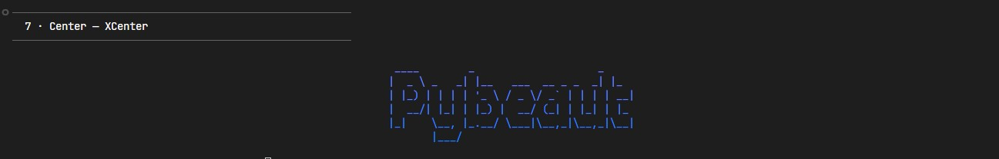

### Text alignment within a block

```python
from pybeaut import Center, Colorate, Colors

text = "Short\nA longer line here\nMedium line"

print("--- CENTER ---")
print(Colorate.Color(Colors.cyan, Center.TextAlign(text, align=Center.center)))

print("--- RIGHT ---")
print(Colorate.Color(Colors.yellow, Center.TextAlign(text, align=Center.right)))
```

---

## ➕ Add

Place two text blocks **side by side**, with optional vertical centering.

```python
from pybeaut import Add, Colorate, Colors

left = Colorate.Vertical(Colors.red_to_yellow,
    " ██████╗ \n"
    "██╔═══██╗\n"
    "██║   ██║\n"
    "╚██████╔╝\n"
    " ╚═════╝ "
)

right = Colorate.Vertical(Colors.blue_to_cyan,
    "██████╗ \n"
    "██╔══██╗\n"
    "██████╔╝\n"
    "██╔══██╗\n"
    "██████╔╝\n"
    "╚═════╝ "
)

print(Add.Add(left, right, center=True))
```

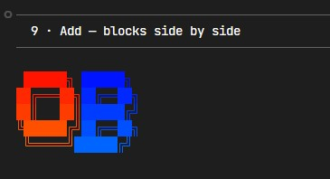

---

## 🏷️ Banner

Decorative text banners using lines and arrows.

### Lines banner

```python
from pybeaut import Banner, Colors

print(Banner.Lines("Welcome to Pybeaut", color=Colors.blue_to_purple))
```

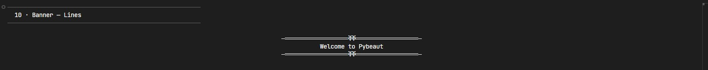

### ASCII art banner with centered text

Use `Add.Add` to place a text block vertically centered next to an ASCII art banner.

```python
from pybeaut import Add, Center, Colorate, Colors

whale = r"""       .
      ":"
    ___:____     |"\/"|
  ,'        `.    \  /
  |  O        \___/  |
~^~^~^~^~^~^~^~^~^~^~^~^~"""

info = (
    "   Pybeaut    \n"
    "   v1.1.1     \n"
    "              \n"
    "   by Backist "
)

colored_whale = Colorate.Vertical(Colors.blue_to_cyan, whale)
colored_info  = Colorate.Vertical(Colors.cyan_to_blue, info)

banner = Add.Add(colored_whale, colored_info, center=True)
print(Center.XCenter(banner))
```

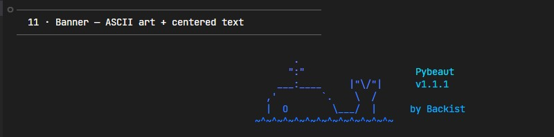

### Arrow

```python
from pybeaut import Banner, Colorate, Colors

arrow = Banner.Arrow(icon='▶', size=2, number=3, direction='right')
print(Colorate.Vertical(Colors.green_to_cyan, arrow))
```

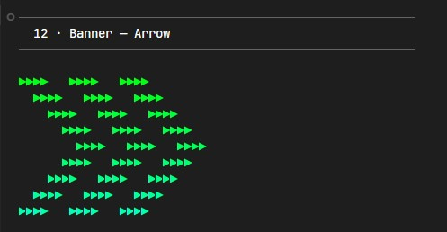

---

## ✨ Fade Effect — Write & Colors

`Write.Print` types text character by character with a live color gradient — great for intros and prompts.

### Write.Print

```python
from pybeaut import Write, Colors

Write.Print(
    "\nWelcome to Pybeaut!\n"
    "Every character appears one by one\n"
    "with a smooth color fade.\n\n",
    Colors.blue_to_purple,
    interval=0.03
)
```

### Write.Input

```python
from pybeaut import Write, Colors

answer = Write.Input(
    "\nEnter your name: ",
    Colors.green_to_cyan,
    interval=0.04,
    input_color=Colors.white
)
print(f"\nHello, {answer}!")
```

### Custom color with StaticRGB

```python
from pybeaut import Colors, Colorate

salmon = Colors.StaticRGB(250, 128, 114)
print(Colorate.Color(salmon, "Custom salmon color via RGB!"))
```

### Mix two static colors

```python
from pybeaut import Colors, Colorate

mixed = Colors.StaticMIX([Colors.red, Colors.blue])
print(Colorate.Color(mixed, "Red + Blue mixed = Purple-ish"))
```

---

## 📦 Boxes

Wrap text inside ASCII or Unicode boxes.

### Simple box

```python
from pybeaut import Banner, Colorate, Colors

box = Banner.SimpleCube("Hello, Pybeaut!")
print(Colorate.Color(Colors.cyan, box))
```

### Double-line Unicode box

```python
from pybeaut import Banner, Colorate, Colors

box = Banner.Box(
    "Pybeaut\nDouble Box",
    up_left="╔═", up_right="═╗",
    down_left="╚═", down_right="═╝",
    left_line="║", right_line="║",
    up_line="═", down_line="═"
)
print(Colorate.Vertical(Colors.blue_to_cyan, box))
```

### Custom characters

```python
from pybeaut import Banner, Colorate, Colors

box = Banner.Box(
    "Custom\nBox Style",
    up_left="┌─", up_right="─┐",
    down_left="└─", down_right="─┘",
    left_line="│", right_line="│",
    up_line="─", down_line="─"
)
print(Colorate.Vertical(Colors.purple_to_blue, box))
```

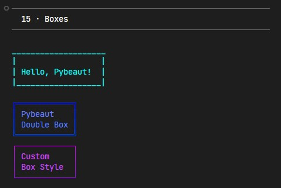

---

## ⚙️ System Functions

Utilities for terminal management.

### Initialize and set terminal title (Windows)

```python
from pybeaut import System, Colorate, Colors

System.Title("My Pybeaut App")  # Windows only

print(Colorate.Color(Colors.green, "Terminal ready!"))
print(Colorate.Color(Colors.yellow, f"Running on Windows: {System.Windows}"))
```

### Check RGB color support

```python
from pybeaut import System, Colorate, Colors

if System.Windows:
    print(Colorate.Color(Colors.green,  "Windows detected  — RGB colors fully supported."))
    print(Colorate.Color(Colors.cyan,   "You can use all Colorate fade functions."))
else:
    print(Colorate.Color(Colors.yellow, "Non-Windows system — RGB support depends on terminal."))
    print(Colorate.Color(Colors.orange, "Most modern terminals (iTerm2, GNOME) work fine."))
```

### Terminal size

```python
from pybeaut import System, Colorate, Colors
from os import get_terminal_size

size = get_terminal_size()
print(Colorate.Color(Colors.cyan, f"Terminal size: {size.columns} cols × {size.lines} rows"))

# Resize (Windows only)
if System.Windows:
    System.Size(120, 30)
    print(Colorate.Color(Colors.green, "Terminal resized to 120x30"))
```

---

## Recommendations

If you have recommendations or ideas for new features, open an issue on the [official repository](https://github.com/Backist/Pybeaut) or submit a request on [PyPI](https://pypi.org/project/pybeaut/).

### Owner

- **[@Backist](https://github.com/Backist/)**

> This project follows **[Semantic Versioning](https://semver.org/)**
